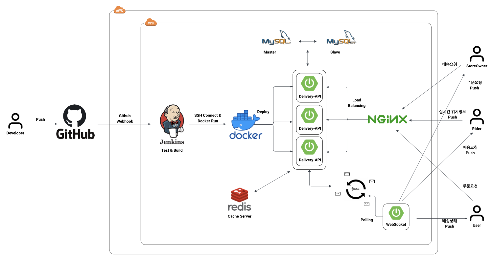
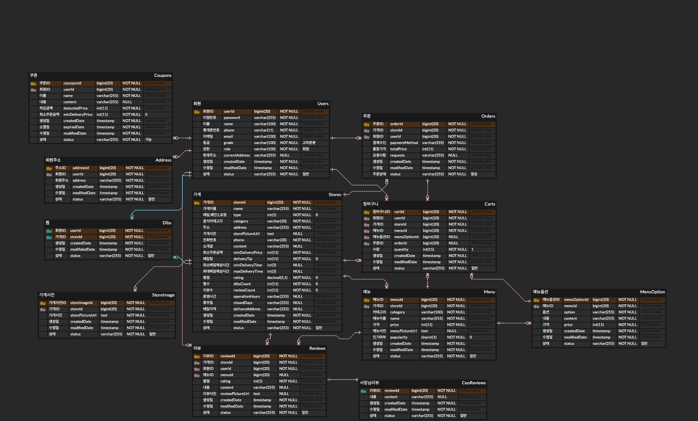
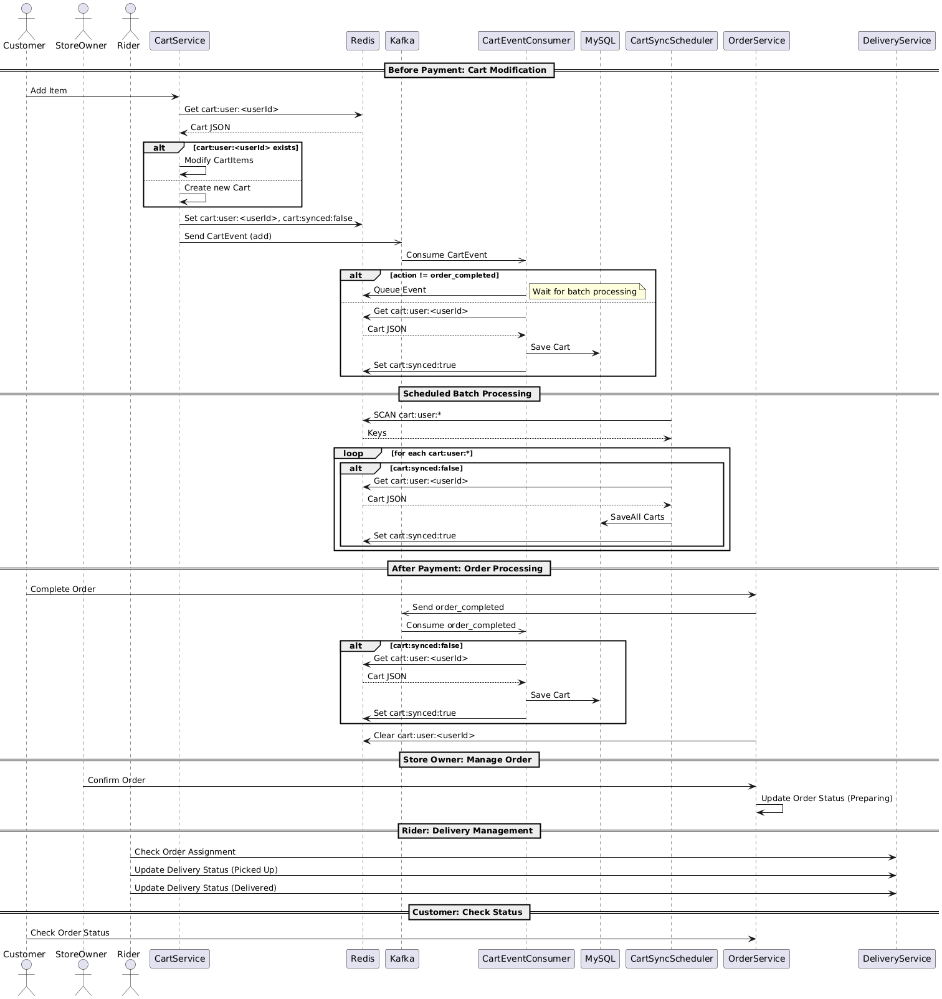
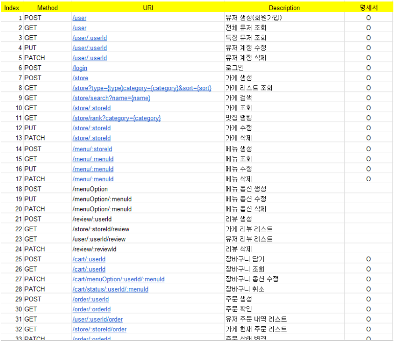

# 🛵 Delivery Platform

> 배달의민족 도메인을 모티브로, **헥사고날 아키텍처 + 이벤트 기반 비동기 처리**를 학습/실험한 멀티 모듈 백엔드 프로젝트.

[]()
[]()
[]()

---

## 📌 프로젝트 개요

**왜 만들었나** — 단순 CRUD를 넘어서 분산 환경에서 발생하는 트레이드오프(캐시-DB 정합성, 분산 락, 이벤트 전파, 모듈 분리)를 직접 경험하고, 그 과정에서 헥사고날 아키텍처가 인프라 변경에 얼마나 견딜 수 있는지 검증해보고 싶었다.

**무엇을 배웠나**
- 헥사고날(Port & Adapter) 구조에서 Adapter 교체가 도메인을 흔들지 않는다는 것
- Redis 캐시 + Kafka 비동기 동기화로 쓰기 부하 분산
- ShedLock으로 다중 인스턴스 환경에서 스케줄러 중복 실행 방지
- WebFlux 기반 reactive WebSocket으로 동시 연결 처리 모델 차이
- DTO/이벤트 컨트랙트를 별도 모듈(`common-event`)로 분리하는 의미

---

## 🏗 아키텍처



| 컴포넌트 | 역할 |
|---------|------|
| **NGINX** | 외부 트래픽 수신, food-delivery-api 인스턴스로 로드 밸런싱 |
| **food-delivery-api** × 3 | REST API. 결제·주문·장바구니 등 주요 트랜잭션 처리. Docker Swarm으로 확장 |
| **websocket** | 라이더/고객 실시간 위치·상태 push (WebFlux 리액티브) |
| **MySQL Master/Slave** | 쓰기 마스터 / 읽기 슬레이브 (계획) |
| **Redis** | 장바구니/배송상태/JWT 블랙리스트 캐시, ShedLock 분산 락 |
| **Kafka** | 도메인 이벤트 비동기 전파 (`order-paid`, `cart-sync`, `delivery-status`) |
| **Jenkins** | GitHub Webhook → Test → Build → SSH로 Docker 배포 (계획) |

> 배경 그림(`docs/architecture.png`)은 학습 단계에서 작성된 목표 아키텍처이며, 일부 항목(MySQL Master-Slave, Jenkins 자동 배포)은 구현 미완으로 [Roadmap](#-roadmap-학습-의도와-함께)에서 별도 추적한다.

---

## 🧱 모듈 구조

```
delivery-platform/                 (Gradle 루트)
├── common-event/                   ── 모듈 간 공유되는 이벤트 record
│   └── DeliveryStatusMessage
├── food-delivery-api/              ── 메인 REST API + 데이터 관리
│   └── 6개 도메인 (cart, menu, order, store, user, delivery) — 모두 헥사고날
└── websocket/                      ── 실시간 push (WebFlux)
    └── DeliveryWebSocketHandler   (JWT 핸드셰이크 인증 적용)
```

각 도메인은 동일한 헥사고날 구조를 따른다:

```
{domain}/
├── adapter/
│   ├── in/web/        — Controller (외부 진입점)
│   ├── in/event/      — Kafka Consumer
│   └── out/
│       ├── persistence/   — JpaRepository 등 어댑터
│       └── event/         — Kafka Producer
├── application/
│   ├── port/in/       — UseCase 인터페이스 + Command DTO
│   ├── port/out/      — Repository Port 인터페이스
│   └── service/       — UseCase 구현
└── domain/            — Entity, VO, Factory, Validator, Domain Event
```

---

## 📐 도메인 모델 (ERD)



핵심 엔티티 6개:

| 엔티티 | 책임 |
|--------|------|
| **User** | 회원가입/조회/수정/탈퇴, soft delete, BCrypt 암호화, role(고객/사장/라이더) |
| **Store** | 가게 CRUD + QueryDSL 동적 검색 (이름/카테고리/배달지역) |
| **Menu** | 메뉴 + MenuOption 1:N, `@EntityGraph`로 N+1 해결 |
| **Cart** | Redis 캐시 우선, Kafka로 DB 비동기 동기화 |
| **Order** | 결제 시 `OrderPaidEvent` 발행 → Cart 비활성화 + Delivery 자동 시작 |
| **Delivery** | 배송 상태 변경, Redis(2시간 TTL) + Kafka로 WebSocket에 push |

**Value Object 활용**: `EncodedPassword`, `UserInfo`, `StoreInfo`, `DeliveryTime` 등 — 도메인 의미를 명확히 하고 불변성 확보.

> 큰 ERD(`docs/erd.png`)는 향후 확장 목표(쿠폰/리뷰/주소/포인트 등)까지 포함된 그림이며, 현재 코드는 핵심 6개 엔티티만 구현한 상태입니다.

---

## 🔄 핵심 시퀀스 — 결제부터 배송까지



### 결제 전 — 장바구니 (Redis 캐시 + Kafka 배치 동기화)
1. 사용자가 카트에 메뉴 추가 → `CartService`가 Redis에 즉시 반영
2. `CartEvent`를 Kafka `cart-sync` 토픽에 발행
3. `CartSyncBatchConsumer`가 이벤트를 Redis 큐에 누적
4. **1시간마다** `@Scheduled` + `@SchedulerLock` (ShedLock)으로 한 인스턴스에서만 배치 실행 → 사용자별 최신 이벤트만 DB로 동기화

### 결제 후 — 주문 → 배송 자동 시작
1. `OrderService.createOrder()` → 주문 PAID 처리
2. `OrderPaidEvent` 발행
3. **두 개 도메인이 동시에 구독**:
   - `cart` 도메인: 카트 비활성화 + Redis cleanup
   - `delivery` 도메인: `Delivery` 엔티티 생성, Redis에 `delivery:status:{orderId}` (TTL 2시간) 설정, `delivery-status` 토픽에 메시지 발행
4. WebSocket 모듈의 `DeliveryStatusEventConsumer`가 `delivery-status` 구독 → 연결된 클라이언트에 push

### 라이더의 상태 변경 → 고객 push
- 라이더가 `POST /delivery/{orderId}/status` 호출 → `DeliveryService.sendStatusUpdate()` → Redis 갱신 + Kafka 발행 → WebSocket으로 고객에게 push

---

## 🛠 기술 선택 이유

| 기술 | 선택 이유 | 고려한 대안 |
|------|----------|------------|
| **Hexagonal + DDD** | 도메인-인프라 분리, 테스트 용이, 어댑터 교체 비용 낮음 | Layered |
| **Kafka** | 다수 컨슈머가 같은 이벤트 구독 가능 (cart, delivery 모두 OrderPaidEvent 처리), 영속성 + replay | RabbitMQ, Spring ApplicationEvent |
| **Redis ShedLock** | 다중 인스턴스에서 스케줄러 중복 실행 방지 | DB row lock (오버헤드↑) |
| **WebFlux WebSocket** | 다수 동시 연결을 적은 스레드로 처리, Reactor `Sinks`로 broadcast | Servlet WebSocket (스레드당 연결) |
| **QueryDSL 5.1 (jakarta)** | 타입 세이프 동적 쿼리 (가게/메뉴 검색), 컴파일 타임 검증 | JPA Specification |
| **JWT (HS256, jjwt 0.12.6)** | 무상태 인증, Redis 블랙리스트로 로그아웃 처리 | Session + Sticky / Spring Session |
| **Spring Cloud AWS Secrets Manager** | prod 프로필에서 비밀값 외부화 | 평문 yml (X) |

---

## 🧩 핵심 구현 포인트

### 장바구니 — Redis 캐시 우선 + 이벤트 배치 동기화
- `CartService.java`: 장바구니 변경 시 Redis 즉시 반영, Kafka로 비동기 동기화 이벤트 발행
- `CartSyncBatchConsumer.java`: 사용자 단위로 최신 이벤트만 골라 DB 반영 (1시간 주기)
- 효과: 쓰기 부하 분산, 동일 카트의 빠른 연속 수정에 대해 DB 쓰기 N→1로 감소

### 분산 락 — ShedLock
```java
@Scheduled(fixedRate = 3600000)
@SchedulerLock(name = "cartSyncTask", lockAtMostFor = "10m", lockAtLeastFor = "1m")
public void processBatchEvents()
```
3대 인스턴스가 동일 스케줄러를 가져도 한 인스턴스만 락을 획득해 작업.

### N+1 해결 — `@EntityGraph` + QueryDSL
- `MenuRepository.findByStore_StoreId`: `@EntityGraph(attributePaths = "options")`로 fetch join
- `StoreRepositoryCustomImpl`: QueryDSL 동적 쿼리로 필요한 컬럼만 selectFrom

### JWT 블랙리스트 로그아웃
- 로그아웃 시 토큰을 Redis에 expiry까지 추가 → 인증 필터에서 매 요청마다 조회 → expiry 후 자동 cleanup

### WebSocket JWT 핸드셰이크 인증
- `DeliveryWebSocketHandler.handle()`: 핸드셰이크 단계에서 `?token=...` 파싱 → `JwtValidator` 검증 → 실패 시 `CloseStatus.POLICY_VIOLATION`으로 즉시 연결 종료

---

## 🚀 실행 방법

### 사전 준비
- JDK 17, Docker, Docker Compose

### 환경 설정
```bash
cp .env.example .env
# .env 파일 열어서 JWT_SECRET, DB_PASSWORD 등 채우기
```

### 인프라 띄우기 (MySQL/Redis/Kafka)
```bash
cd food-delivery-api
docker-compose up -d
```

### API 서버 실행
```bash
# 루트에서
./gradlew :food-delivery-api:bootRun
# 별도 터미널에서
./gradlew :websocket:bootRun
```

### 빌드만
```bash
./gradlew clean build -x test
```

---

## 📡 API 명세

전체 API 명세 (계획 기준 30개):



런타임에 Swagger UI: `http://localhost:8080/swagger-ui/index.html`

주요 엔드포인트:
| 도메인 | 엔드포인트 |
|--------|-----------|
| 인증 | `POST /login` |
| 회원 | `POST /user`, `GET /user/{id}`, `PUT /user/{id}`, `PATCH /user/{id}` |
| 가게 | `POST /store`, `PUT /store/{id}`, `DELETE /store/{id}`, `GET /store/{id}`, `GET /store/search` |
| 메뉴 | `POST /menu`, `PUT /menu/{id}`, `DELETE /menu/{id}`, `GET /menu/{id}`, `GET /menu/search` |
| 장바구니 | `POST /cart`, `GET /cart/{userId}`, `PATCH /cart/quantity`, `PATCH /cart/option`, `DELETE /cart` |
| 주문 | `POST /order`, `GET /order`, `GET /order/{id}`, `DELETE /{orderId}` |
| 배송 | `POST /delivery/{orderId}/{status,complete,cancel}` |
| 실시간 | `WS /ws?orderId=...&token=...` |

---

## 🗺 Roadmap (학습 의도와 함께)

### 추가 도메인 (설계 완료, 구현 미완)
- [ ] **리뷰** — ERD에 정의됨, CRUD 4개 엔드포인트 정의
- [ ] **포인트 시스템** — FIFO 차감 알고리즘 설계 완료 ([`docs/point-design.md`](docs/point-design.md))
- [ ] **인기 게시글/가게 랭킹** — Redis sorted set + 1시간 배치 설계 완료 ([`docs/popularity-design.md`](docs/popularity-design.md))
- [ ] **쿠폰** — ERD 정의됨
- [ ] **사장님 SSE 알림** — 근방 가게 조회 급증 알림

### 인프라/운영
- [ ] **MySQL Master-Slave 복제** — 도면에는 있으나 단일 인스턴스 상태
- [ ] **Jenkins + Docker Swarm 자동 배포** — 도커 명령어 메모는 있으나 Jenkinsfile 미작성
- [ ] **NGINX 설정** — 키만 보유, nginx.conf 미작성

### 보안/품질
- [ ] **WebSocket의 user-order 소유자 검증** — 현재는 JWT 유효성만 확인, 토큰 주체와 orderId 소유자 매칭은 모듈 간 호출 필요
- [ ] **통합 테스트 + Testcontainers** — 현재 컨텍스트 로드 테스트만 존재
- [ ] **DLQ + 재시도 정책** — Kafka 컨슈머 실패 처리

---

## ⚠️ Limitations

- **학습 프로젝트**입니다. 일부 운영 인프라(NGINX 설정, Master-Slave, Jenkins)는 도면/메모 단계에서 멈춰 있습니다. 실 운영 환경에 그대로 사용 금지.
- **테스트 커버리지가 낮습니다.** 수동 검증 위주이며 통합 테스트는 Roadmap 참조.
- 일부 외부 폴더(`../배달의민족/`)에는 학습 시점의 자격증명 메모/.pem 파일이 남아 있습니다. 이 저장소에는 포함되지 않았으며, `.gitignore`로 차단되어 있습니다...

---

## 📝 진화 과정 — 어떻게 여기까지 왔나

git log를 따라 본 프로젝트의 큰 마일스톤:

| 커밋 | 의미 |
|------|------|
| `8bcdf56` JWT 로그인 인증방식 리팩토링 | 인증 방식을 세션 → 무상태 JWT로 |
| `d355527` webflux로 리팩토링 | WebSocket 모듈을 Servlet → WebFlux 리액티브로 |
| `cd6d325` Cart DB 동기화 스케줄러 추가 | 동기 → 배치 비동기 방식 도입 |
| `30b2d91` 장바구니 서비스 리팩토링 — DB 동기화 방식 메시지 방식으로 비동기 처리 | Kafka 이벤트 도입 |
| `9fd178c` ShedLock + Redis 분산 락 기반 스케줄링 | 다중 인스턴스에서도 안전한 스케줄러 |
| `b2aa7ea` 헥사고날 구조로 변경 | 도메인 단위로 Port & Adapter 분리 시작 |
| `46cfeb6` ~ `716e9ca` Refact: store/menu/cart 도메인 헥사고날 구조로 변경 | 도메인별 점진적 마이그레이션 |
| `(이번 정리)` order/delivery 도메인 헥사고날 통일 + common-event 분리 + WebSocket JWT 인증 | 마이그레이션 완료 + 보안 보강 |

`bak/` 폴더(`../배달의민족/bak/`)에 헥사고날 마이그레이션 이전의 옛 엔티티 코드 일부가 보존되어 있어, 진화 과정을 비교해 볼 수 있다.

---

## 📂 추가 자료
- [`docs/architecture.pdf`](docs/architecture.pdf) — 원본 아키텍처 다이어그램 (벡터)
- [`docs/erd-ver1.pdf`](docs/erd-ver1.pdf) — 핵심 엔티티 ERD
- [`docs/sequence-order.svg`](docs/sequence-order.svg) — 주문 시퀀스 다이어그램 (벡터)
- [`docs/popularity-design.md`](docs/popularity-design.md) — 인기 랭킹 설계
- [`docs/point-design.md`](docs/point-design.md) — 포인트 시스템 설계
